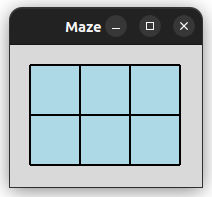
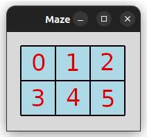
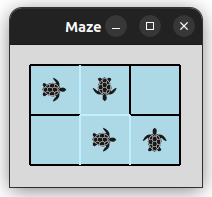

# Labyrinth Project

This project is a Python application that creates a labyrinth and a graph representation of the labyrinth using
multi-threading. The labyrinth is represented as a grid of tiles, and each tile can have walls on its borders.
The labyrinth is drawn using the Tkinter library.

## Dependencies

- Python 3.6 or higher
- Tkinter

## Modules

- `tiles.py`: Contains the `Tile` class which is used to create a tile in the labyrinth.
- `labyrinth.py`: Contains the `Labyrinth` class which is used to create and solve the labyrinth.
- `grafo.py`: Contains the `Grafo` class which is used to create a graph representation of a labyrinth.
- `globales.py`: Contains global variables that are used for thread synchronization and inter-thread communication.
- `worker.py`: Contains the `Worker` function which is used to simulate different random graphs.
- `ejemplo_1.py`: This module uses the `Grafo` class to create a graph representation of a labyrinth and saves it as a
  JSON file.
- `ejemplo_2.py`: An example of multi-threading execution where Front-end and Back-end modules are running in different
  threads. Inter-thread communication is implemented with a Queue and a mutex lock.

## How to Use

### Labyrinth Class

The `Labyrinth` class is used to create and update the labyrinth GUI. Here's how to use it:

1. Initialize a new instance of the `Labyrinth` class. The constructor takes three arguments: the number of rows,
   the number of columns in the labyrinth, and the path to the JSON file that contains the graph representation of the
   labyrinth.

```python
maze = Labyrinth(3, 5, path='/dev/shm/graph.json')
```

2. Start the Tkinter event loop by calling the `start` method. This method will keep the window open until it is closed
   by the user.

```python
maze.start()
```

3. The `Labyrinth` class also interacts with a queue object from the `globales` module for inter-thread communication.
   The `Labyrinth` class reads from the queue to get updates about the labyrinth's state. These updates are produced by
   another thread that simulates the labyrinth's changes over time. The queue ensures that these updates are processed
   in the order they were produced, and it allows the `Labyrinth` class to wait for new updates if none are available.

<p align="center">
  
</p>


### Grafo Class

The `Grafo` class in the `grafo.py` module is used to create a graph representation of the labyrinth. Here's how to use 
it:

1. Import the `Grafo` class from the `grafo` module.

```python
from grafo import Grafo
```

2. Initialize a new instance of the `Grafo` class. The constructor takes three arguments: a dictionary representing the 
adjacency list of vertices, a dictionary representing the adjacency list of weighted edges, and a dictionary representing 
the turtle's position and direction.

```python
vertex_list = {0: [1, 3], 1: [0, 2, 4], 2: [1, 5], 3: [0, 4], 4: [1, 3, 5], 5: [2, 4]}
edges_list = {'(0, 1)': 1, '(0, 3)': 0, '(1, 2)': 0, '(1, 4)': 1, '(2, 5)': 0, '(3, 4)': 1, '(4, 5)': 1}
turtle_list = {0: 1, 1: 4, 4: 5, 5: 'f'}
grafo = Grafo(vertex_list, edges_list, turtle_list)
```

#### Vertices Labeling

In the labyrinth, each vertex (tile) is labeled with a unique number from `0` to the total number of tiles minus `1`. 
The labeling follows a row-major order, which means that the tiles are labeled row by row, from left to right and 
top to bottom.

For example, consider a 2x3 labyrinth. The tiles would be labeled as follows:

```
0 1 2
3 4 5
```

In this example, the tile in the `top left corner` is labeled `0`, the tile to its right is labeled 1, and so on. 
The tile in the `bottom right corner` is labeled `5`.

This labeling system is used to represent the labyrinth as a graph, where each tile corresponds to a vertex in the 
graph. The adjacency between tiles (whether two tiles are next to each other) is represented as edges in the graph.

<p align="center">
  
</p>

The image above illustrates the tile labeling system for a larger labyrinth. As you can see, the labels start at 0 
in the top left corner and increase by 1 for each tile to the right and down, following the row-major order.

3. Add an edge to the graph using the `add_edge` method. This method takes three arguments: the two vertices that the 
edge connects and the weight of the edge. A weight of 1 represents a path between two rooms, and a weight of 0 
represents a wall.

```python
grafo.add_edge(0, 1, 1)  # Add a path between rooms 0 and 1
grafo.add_edge(1, 2, 0)  # Add a wall between rooms 1 and 2
```

4. Send the graph to the Queue using the `send_graph` method. This method gets the graph and puts it into the global 
queue 'cola'. This can be used to share the graph between different parts of the program or with different threads.

```python
grafo.send_graph()
```

5. Save the graph as a JSON file using the `save_graph` method. This method takes one argument: the path to the JSON 
   file.

```python
grafo.save_graph('/dev/shm/graph.json')
```

This will create a JSON file that represents the labyrinth as a graph. The JSON file will contain the adjacency list of
vertices, the adjacency list of weighted edges, and the turtle's position and direction.


For the example above, the JSON file would look like this:

```json
{
  "vertex_list": {
    "0": [1, 3],
    "1": [0, 2, 4],
    "2": [1, 5],
    "3": [0, 4],
    "4": [1, 3, 5],
    "5": [2, 4]
  },
  "edges_list": {
    "(0, 1)": 1,
    "(0, 3)": 0,
    "(1, 2)": 0,
    "(1, 4)": 1,
    "(2, 5)": 0,
    "(3, 4)": 1,
    "(4, 5)": 1
  },
  "turtle_list": {
    "0": 1,
    "1": 4,
    "4": 5,
    "5": "f"
  }
}
```
And the labyrinth would look like this:
<p align="center">
  
</p>


### Globales Module

This module contains global variables that are used for thread synchronization and inter-thread communication. It uses
Python's built-in threading and queue modules to create a lock object and a queue object. The lock object, `candado`, is
used to ensure that only one thread can execute a particular section of code at a time, which is useful for preventing
race conditions. The queue object, `cola`, is used for inter-thread communication, where one thread can put messages (or
any Python data type) into the queue, and another thread can retrieve them.


### Ejemplo_1 Module

This module creates a graph representation of a labyrinth and saves it as a JSON file. The graph is created by adding
vertices (rooms in the labyrinth) and edges (paths between the rooms). The weight of an edge determines whether there is
a path between two rooms (weight 1) or a wall (weight 0).

To run this module, first run the `labyrinth.py` module to launch the GUI that displays the labyrinth:
```bash
python3 labyrinth.py
```

Then, navigate to the project directory and run the `ejemplo_1.py` file in a separate terminal window:
```bash
python3 ejemplo_1.py
```


### Ejemplo_2 Module

This module demonstrates how to use multi-threading to run the Front-end and Back-end modules in different threads.
Inter-thread communication is implemented with a Queue and a mutex lock.

To run this module, navigate to the project directory and run the `ejemplo_2.py` file:

```bash
python3 ejemplo_2.py
```


## License

This project is licensed under the MIT License - see the [LICENSE](LICENSE) file for details.
